# Pendahuluan
	ANTARES merupakan sebuah Horizontal IoT Platform, yang berarti kami mencoba untuk 
	menjadikan layanan kami se-umum mungkin agar solusi vertikal IoT anda dapat menyesuaikan 
	dengan arsitektur yang umumnya digunakan. Banyak kasus-kasus IoT yang dapat dipecahkan 
	dengan menggunakan layanan kami, contohnya adalah smart home, smart metering,
	asset tracking, smart building, dan lain-lain.

	Dokumentasi ini akan menunjukkan anda cara untuk mengirim data sensor ke ANTARES. 
	Ada 4 tahapan yang dapat ditempuh untuk mencapai hal tersebut:

	1. Registrasi akun
	2. Buat app
	3. Tambahkan device
	4. Pengiriman data ke Antares

	Langkah-langkah yang lebih rinci dapat anda temukan setelah segmen ini. Jika terdapat 
	informasi yang salah atau ada bagian dari tutorial ini yang tidak lengkap, jangan ragu 
	untuk memberitahu kami pada email support@antares.id.

<!-- index.html -->

<!-- docs/_sidebar.md -->
1. [Registasi](regis.md)
2. [Buat App](buat.md)
3. [Tambah Device App](tambah.md)
4. [Quickstar](quick.md)

# Contoh Kode dan Library
	Di bawah ini adalah SDK (Source Development Kit) untuk beberapa device IoT. 
	Jika device yang anda pakai tidak terdapat di bawah ini, anda tetap dapat menggunakan 
	layanan kami dengan menggunakan RESTful API. Apakah anda merupakan seorang device maker? 
	Ingin bekerjasama dengan kami? Ingin membuat library device anda tersedia 
	untuk komunitas kami? Anda dapat menghubungi kami pada support@antares.id

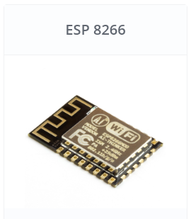     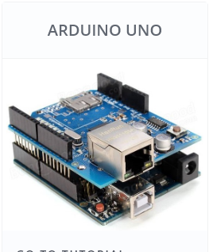 

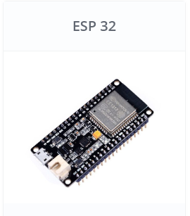     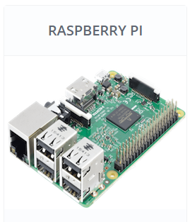

# Data

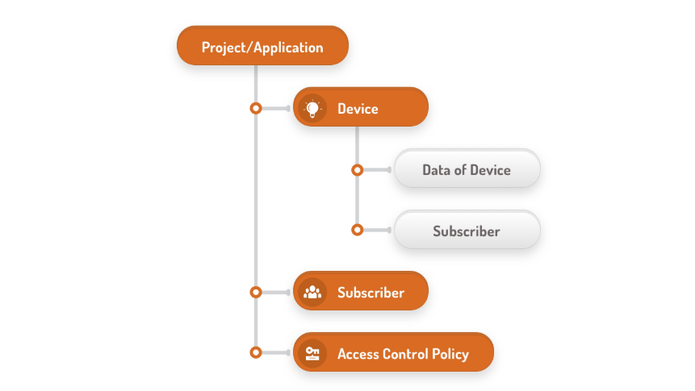

# Port Configuration

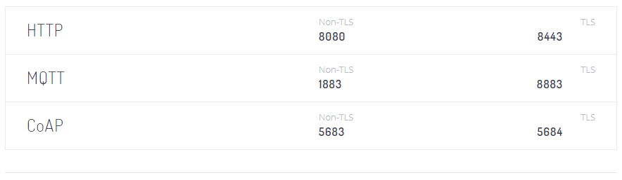

# API HTTP

## 1.Pendahuluan
Antares menggunakan approach RESTful dalam mengembangkan API sehingga API yang 
disediakan lebih representatif dan mudah digunakan user. Sebuah API terdiri atas 
URL dan parameter.

URL

URL merupakan kependekan dari Uniform Resource Locator. URL dalam bahasa sederhana adalah link. 
URL tersusun dari domain dan diikuti port. Dalam banyak kasus, https tidak terlihat portnya, 
ketika server tersebut menggunakan port default (443). Oleh karena itu, server yang 
tidak menggunakan port default, harus dicantumkan portnya, contoh

	https://platform.antares.id:8443

Penjelasan lebih detail terkait RESTful API bisa didapatkan di https://www.restapitutorial.com/

Parameter

Parameter digunakan ketika ingin menginputkan sesuatu melalui API. 
Parameter bisa terdapat di Headers, Path, dan Query String Parameter.

Header Parameter

	X-M2M-Origin:{{access-key}}
	Content-Type:application/json;ty=3
	Accept:application/json

Path Parameter

	https://platform.antares.id:8443/~/antares-cse/antares-id/{{your-application-name}}

Query String Parameter

Query string parameters digunakan dengan simbol tanda tanya (?) di URLnya. 
Setelah tanda tanya (?) adalah parameter dan nilainya yang dihubungkan 
dengan simbol sama dengan (=). Setiap query string parameter 
dipisahkan dengan simbol (&).

	https://platform.antares.id:8443/~/antares-cse/antares-id/{{your-application-name}}?fu=1&ty=3&lim=5HTTPCopy

Penjelasan lebih detail terkait parameters silahkan dapatkan di 
https://idratherbewriting.com/learnapidoc/docapis_doc_parameters.html

## 2. List Query String Parameter
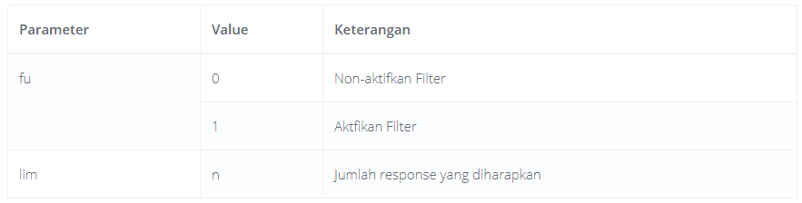

## 3. Device

### Create
~ Request XML
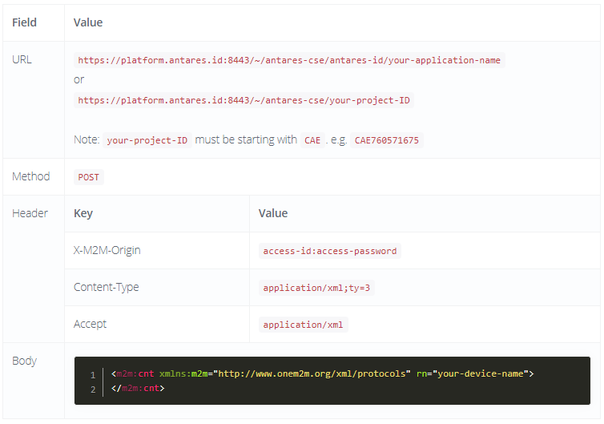

~ Request JSON
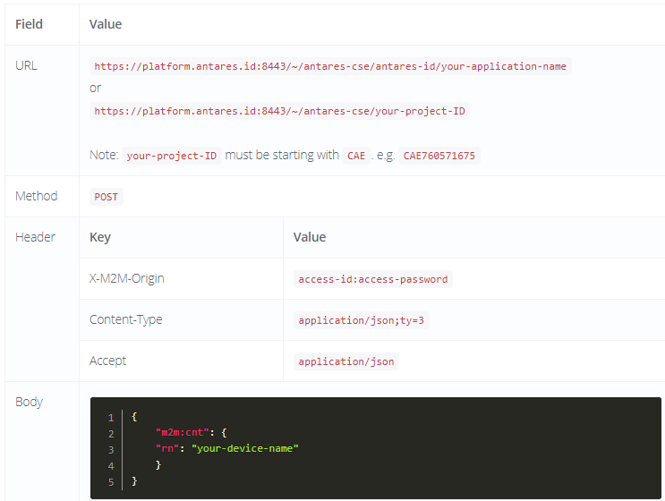

~ Response XML

	<?xml version="1.0" encoding="UTF-8"?>
	<m2m:cnt xmlns:m2m="http://www.onem2m.org/xml/protocols" 
	xmlns:hd="http://www.onem2m.org/xml/protocols/homedomain" rn="your-device-name">
	<ty>3</ty>
	<ri>/antares-cse/cnt-377170374</ri>
	<pi>/antares-cse/CAE492050112</pi>
	<ct>20191119T160648</ct>
	<lt>20191119T160648</lt>
	<acpi>/antares-cse/acp-35730207</acpi>
	<acpi>/antares-cse/acp-891035820</acpi>
	<et>20201119T160648</et>
	<st>0</st>
	<mni>30000000</mni>
	<mbs>10000</mbs>
	<mia>0</mia>
	<cni>0</cni>
	<cbs>0</cbs>
	<ol>/antares-cse/antares-id/your-application-name/your-device-name/ol</ol>
	<la>/antares-cse/antares-id/your-application-name/your-device-name/la</la>
	</m2m:cnt>

~ Response JSON

	{
	    "m2m:cnt": {
	        "rn": "learnLora",
	        "ty": 3,
	        "ri": "/antares-cse/cnt-456680027",
	        "pi": "/antares-cse/CAE492050112",
	        "ct": "20191119T162939",
	        "lt": "20191119T162939",
	        "acpi": [
	            "/antares-cse/acp-35730207",
	            "/antares-cse/acp-891035820"
	        ],
	        "et": "20201119T162939",
	        "st": 0,
	        "mni": 30000000,
	        "mbs": 10000,
	        "mia": 0,
	        "cni": 0,
	        "cbs": 0,
	        "ol": "/antares-cse/antares-id/your-application-name/your-device-name/ol",
	        "la": "/antares-cse/antares-id/your-application-name/your-device-name/la"
	    }
	}

### Retrieve All Devices ID of a Particular Project
~ Request XML
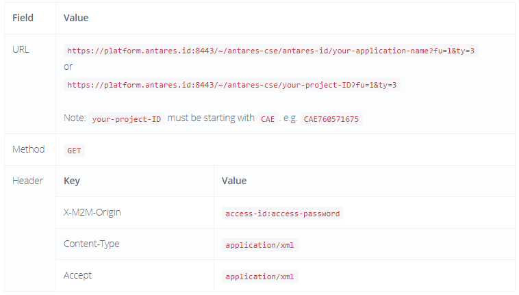

~ Request JSON

~ Response XML

	<?xml version="1.0" encoding="UTF-8"?>
	<m2m:uril xmlns:m2m="http://www.onem2m.org/xml/protocols" xmlns:hd="http://www.onem2m.org/
	xml/protocols/homedomain">/antares-cse/antares-id/your-application-name/your-device-name
	/antares-cse/antares-id/your-application-name/your-device-name2
	</m2m:uril>

~ Response JSON

	{
	    "m2m:uril": [
	        "/antares-cse/antares-id/your-application-name/your-device-name",
	        "/antares-cse/antares-id/your-application-name/your-device-name2",
	    ]
	}

### Retrieve a Particular Device
~ Request XML
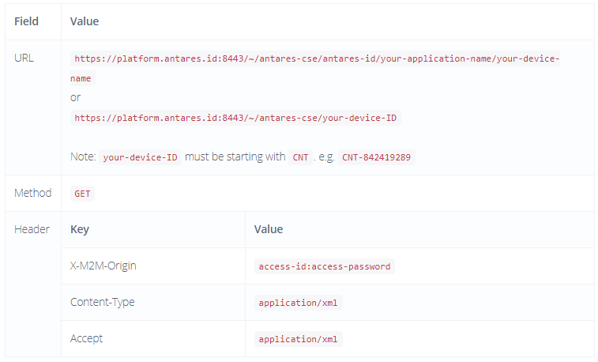

~ Request JSON
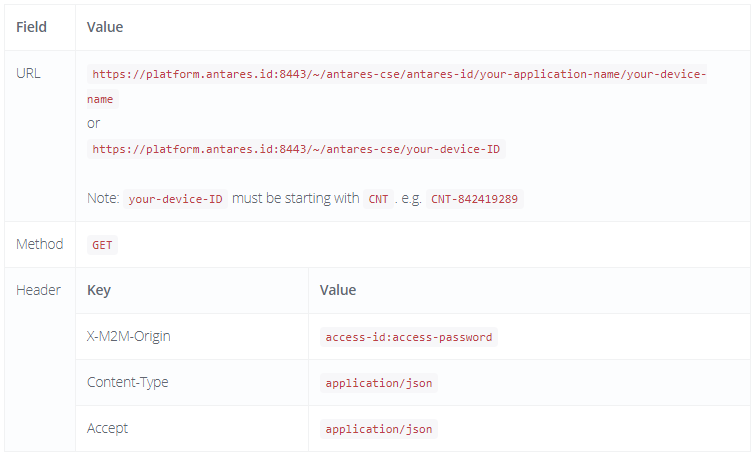
~ Response XML

	<?xml version="1.0" encoding="UTF-8"?>
	<m2m:cnt xmlns:m2m="http://www.onem2m.org/xml/protocols" xmlns:hd="http://www.onem2m.org/xml/
	protocols/homedomain" rn="your-device-name">
	    <ty>3</ty>
	    <ri>/antares-cse/cnt-456680027</ri>
	    <pi>/antares-cse/CAE492050112</pi>
	    <ct>20191119T162939</ct>
	    <lt>20191119T162939</lt>
	    <acpi>/antares-cse/acp-35730207</acpi>
	    <acpi>/antares-cse/acp-891035820</acpi>
	    <et>20201119T162939</et>
	    <st>0</st>
	    <mni>30000000</mni>
	    <mbs>10000</mbs>
	    <mia>0</mia>
	    <cni>0</cni>
	    <cbs>0</cbs>
	    <ol>/antares-cse/antares-id/your-application-name/your-device-name/ol</ol>
	    <la>/antares-cse/antares-id/your-application-name/your-device-name/la</la>
	</m2m:cnt>

~ Response JSON

	{
	    "m2m:cnt": {
	        "rn": "your-device-name",
	        "ty": 3,
	        "ri": "/antares-cse/cnt-456680027",
	        "pi": "/antares-cse/CAE492050112",
	        "ct": "20191119T162939",
	        "lt": "20191119T162939",
	        "acpi": [
	            "/antares-cse/acp-35730207",
	            "/antares-cse/acp-891035820"
	        ],
	        "et": "20201119T162939",
	        "st": 0,
	        "mni": 30000000,
	        "mbs": 10000,
	        "mia": 0,
	        "cni": 0,
	        "cbs": 0,
	        "ol": "/antares-cse/antares-id/your-application-name/your-device-name/ol",
	        "la": "/antares-cse/antares-id/your-application-name/your-device-name/la"
	    }
	}

### Delete a Particular Device
~ Request XML
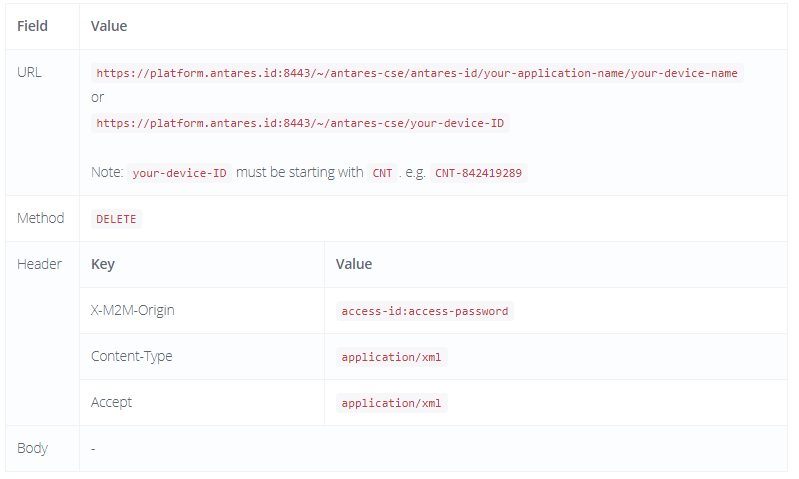

~ Request JSON
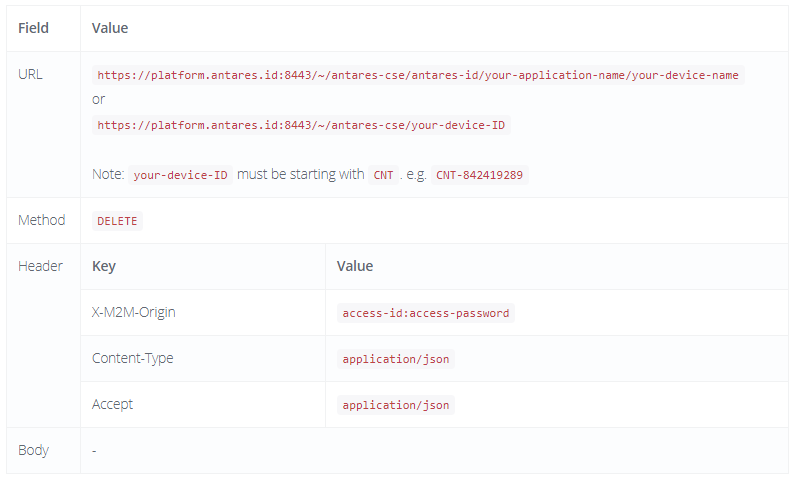
