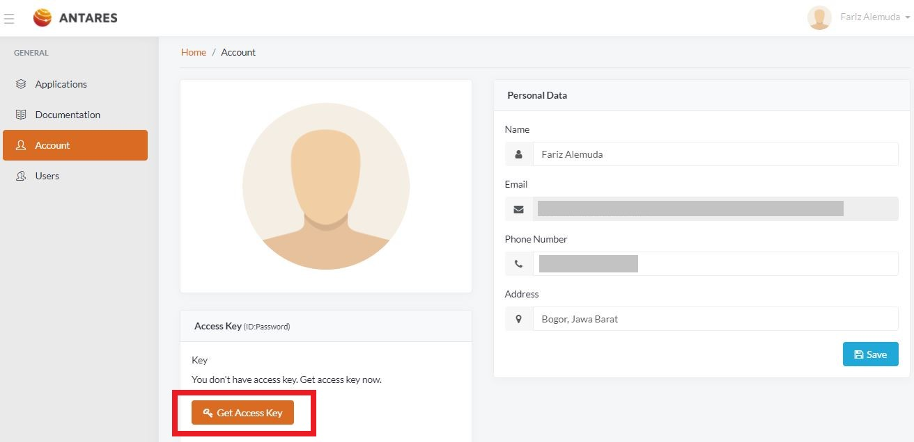
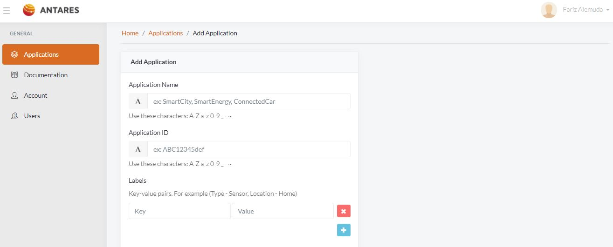
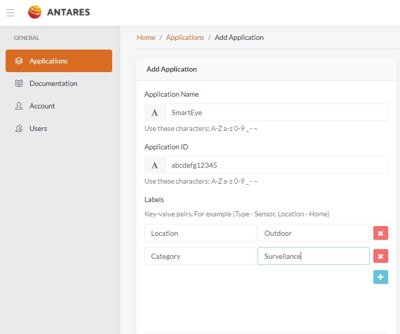

# 2. Buat App

> Sebelum membuat application, anda harus membangkitkan access key. Proses ini hanya 
dilakukan sekali jika anda merupakan pengguna baru ANTARES. Anda dapat menemukan 
pilihan ini dengan mengunjungi menu Account -> Access Key -> Get Access key. 
Access Key merupakan identitas akun anda. Harap simpan access key anda secara aman.

> Setelah selesai, kita dapat membuat application. Kembali ke menu Application 
pada halaman dashboard, klik Create an Application. Anda akan masuk ke halaman berikut:

>Silahkan isi dengan informasi yang diperlukan.

Selamat, anda telah membuat application pertama anda di ANTARES! Anda dapat menemukan 
application yang telah dibuat pada dashboard anda.

<!-- docs/_sidebar.md -->
* [Pendahuluan](README.md)
	1. [Registasi](regis.md)
	2. [Buat App](buat.md)
	3. [Tambah Device App](tambah.md)
	4. [Quickstar](quick.md)