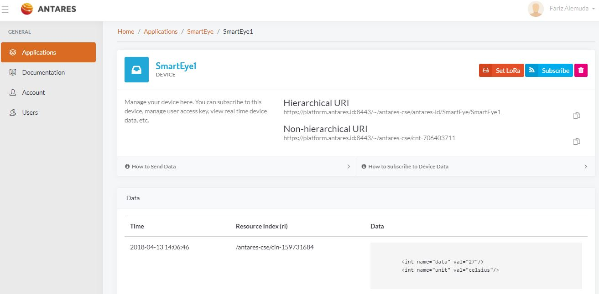

# 4. Quickstar

> Di bawah ini adalah beberapa contoh kode yang dapat anda gunakan untuk 
mengirim data dari proyek yang telah anda buat ke ANTARES.
Di bawah ini adalah video tutorial yang dapat anda gunakan untuk mengirim 
dan mendapatkan data dari ANTARES melalui ESP8266 (HTTP).
Harap install library ini pada Arduino IDE.

    #include <AntaresESP8266HTTP.h>

    #define ACCESSKEY "your-access-key"
    #define WIFISSID "your-wifi-ssid"
    #define PASSWORD "your-wifi-password"

    #define projectName "your-project-name"
    #define deviceName "your-device-name"

    AntaresESP8266HTTP antares(ACCESSKEY);

    void setup() {
      Serial.begin(115200);
      antares.setDebug(true);
      antares.wifiConnection(WIFISSID,PASSWORD);
    }

    void loop() {
      int temp = random(25,30);
      int hum = random(75,90);

      antares.add("temperature", temp);
      antares.add("humidity", hum);

      antares.send(projectName, deviceName);
      delay(10000);
    }

> Di bawah ini adalah tutorial yang dapat anda gunakan untuk mengirim 
dan mendapatkan data dari ANTARES melalui ESP8266(MQTT).
Harap install library ini pada Arduino IDE.

    #include <AntaresESP8266MQTT.h>

    #define ACCESSKEY "your-access-key"
    #define WIFISSID "your-wifi-ssid"
    #define PASSWORD "your-wifi-password"

    #define projectName "your-project-name"
    #define deviceName "your-device-name"

    AntaresESP8266MQTT antares(ACCESSKEY);

    void setup() {
      Serial.begin(115200);
      antares.setDebug(true);
      antares.wifiConnection(WIFISSID,PASSWORD);
      antares.setMqttServer();
    }

    void loop() {
      int temp = random(25,30) ;
      int hum = random(75,90);

      antares.add("temperature", temp);
      antares.add("humidity", hum);

      antares.publish(projectName, deviceName);
      delay(5000);
    }

>Silahkan install antares-http dengan npm terlebih dahulu, pastikan npm dan NodeJS 
terinstall pada CMD (Windows) atau Terminal (Linux):
Informasi lebih lanjut mengenai Antares untuk NodeJS dapat dilihat di halaman npm antares-http.

    npm init
    npm install antares-http --save

      const antares = require('antares-http');

      data = {
        temperature: 32,
        humidity: 80,
      }
      antares.setAccessKey('your-access-key');
      antares.send(data, 'your-project-name', 'your-device-name')
      .then((response) => {
        console.log(response);
      });

>Silahkan install antares-http dengan pip terlebih dahulu, pastikan pip dan Python 
terinstall pada CMD (Windows) atau Terminal (Linux):
Informasi lebih lanjut mengenai Antares untuk Python dapat dilihat di halaman PyPi antares-http.

    pip install antares-http

      from antares_http import antares

      data = {
          'temperature' : 32,
          'humidity' : 80
      }
      antares.setAccessKey('your-access-key')
      antares.send(data, 'your-project-name', 'your-device-name')

<!-- docs/_sidebar.md -->
* [Pendahuluan](README.md)
	1. [Registasi](regis.md)
	2. [Buat App](buat.md)
	3. [Tambah Device App](tambah.md)
	4. [Quickstar](quick.md)