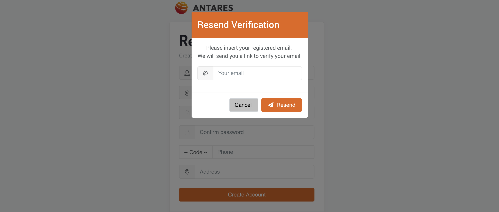

# 1. Registrasi
	

> Konsol ANTARES terdapat pada link berikut. Jika anda telah memiliki akun ANTARES, 
  silahkan langsung login ke konsol. Jika belum, anda perlu melakukan registrasi agar 
  dapat menggunakan layanan ANTARES. Ingin melakukan registrasi? silahkan kunjungi 
  link berikut atau dengan klik tombol Register di halaman konsol.

> Setelah mengisi hal-hal yang diperlukan, kami akan mengirim anda email verifikasi. 
Harap untuk klik tautan yang terdapat pada email tersebut untuk melakukan verifikasi 
pada akun anda. Jika email verifikasi belum muncul pada email anda, anda bisa 
klik Resend Verification seperti pada gambar di bawah.

>Karena anda sudah membuat akun, anda bisa langsung masuk ke konsol ANTARES. 
Tampilannya akan seperti di bawah.

<!-- docs/_sidebar.md -->
* [Pendahuluan](README.md)
	1. [Registasi](regis.md)
	2. [Buat App](buat.md)
	3. [Tambah Device App](tambah.md)
	4. [Quickstar](quick.md)