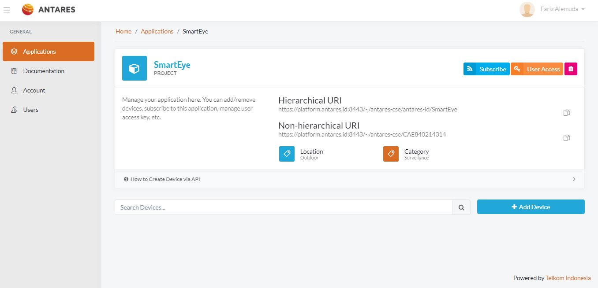
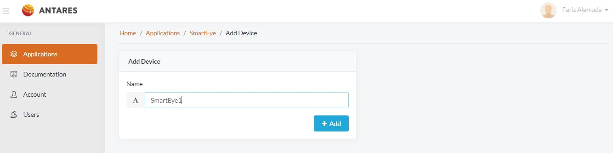
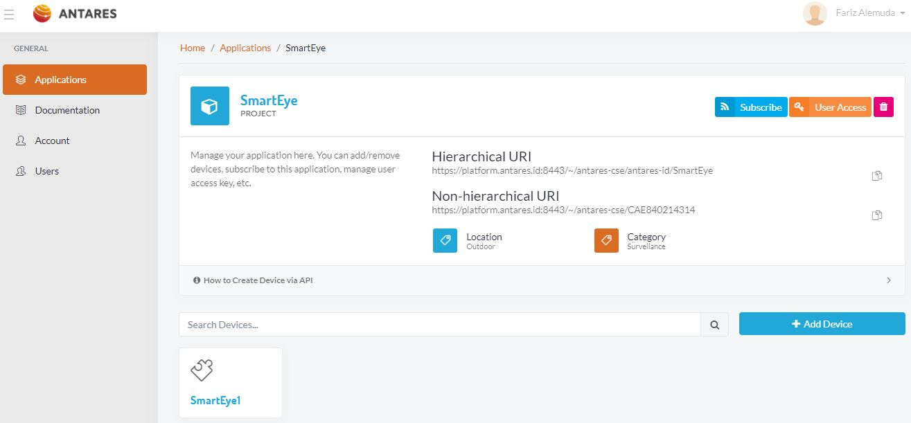

# 3. Tambah Device App

> Internet of Things bersangkutan dengan benda-benda atau things. Pada segmen ini, 
kita akan membuat suatu device untuk tempat menaruh data.

Halaman di bawah akan muncul. Silahkan klik Add Device. Selain klik Add Device untuk 
menambahkan device, anda juga dapat membuat device dengan menggunakan RESTful API pada 
segmen HTTP API. Anda juga dapat melakukan subscription ke device, jadi jika ada data baru 
yang masuk ke device, anda akan mendapatkan notifikasi. Anda dapat memanfaatkan 
notifikasi tersebut untuk membuat logika pada program yang anda buat.

> Ambil nama untuk device anda. Dalam kasus ini, kami akan beri nama "SmartEye1"

>Setelah device berhasil dibuat, akan muncul di dashboard anda seperti berikut.

Anda telah sukses membuat sebuah device. Ikuti langkah berikutnya untuk menaruh data 
pada device yang telah anda buat.

<!-- docs/_sidebar.md -->
* [Pendahuluan](README.md)
	1. [Registasi](regis.md)
	2. [Buat App](buat.md)
	3. [Tambah Device App](tambah.md)
	4. [Quickstar](quick.md)